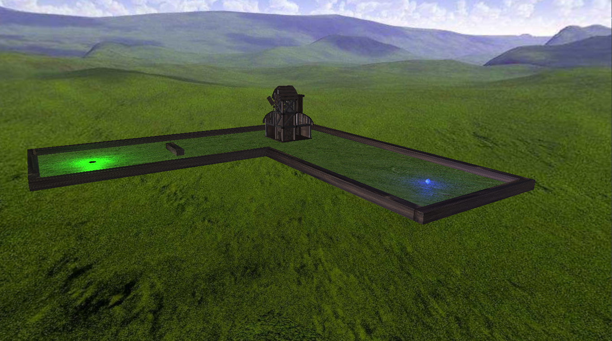
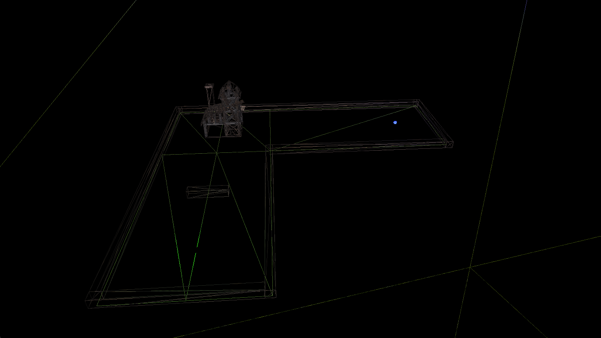
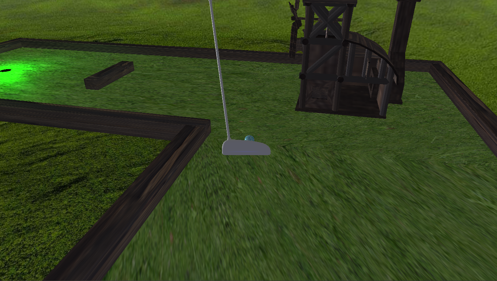

# Mini Golf 3D Simulator

## Authors
- Szymon Korus
- Bartosz Mroczkowski
- Kacper Świątek

## Project Description
The Mini Golf Simulator is a game developed using C++ and the OpenGL graphics API. The game allows players to aim, choose the strength of their shot, and navigate the scene to hit the ball into the hole with as few strokes as possible. Project uses **dynamic pipeline**. Key features of the simulator include:
- **Two Camera Movement Modes** - the first one allows for free movement around the scene, and the second controls the camera movement around the ball.
- **Textures blending**
- **Dynamic Lighting** - lighting simulation using Phong shading models
- **Game Physics** - ball movement based on real-world physics principles

## All used libraries
- **GLEW**
- **GLM**
- **GLFW3**

## My Contribution to the Project
- Physics for the Club and Ball: Developed the physics system to simulate the ball's movement and its interaction with the club.
- Collision Detection: Implemented collision detection to handle interactions between the ball and obstacles on the course.
- Object Loading and Buffering: Created functionality to load 3D models and transfer them to GPU buffers for efficient rendering.
- Code Refactoring: Established classes Scene, GameObject, Script, Component, and Collider, and reorganized the code for easier maintenance and extension.
  
## Controls
### Aiming Mode:
- **A** - move the camera left
- **D** - move the camera right
- **Space** - holding increases shot power; release to hit the ball

### Free Movement Mode:
- **W** - move forward
- **A/D** - move left/right
- **Mouse** - rotate the camera

### Other Controls:
- **C** - switch camera modes
- **R** - reset ball position
- **V** - toggle wireframe mode
- **Esc** - exit the game

## Preview
 
 

